# Reporte: manipulación de imágenes como matrices con NumPy

## 1. Exploración de la imagen

La imagen de entrada utilizada fue `Imagen.jpg`. El programa acepta también el nombre solicitado `image.png` si ese archivo está presente.

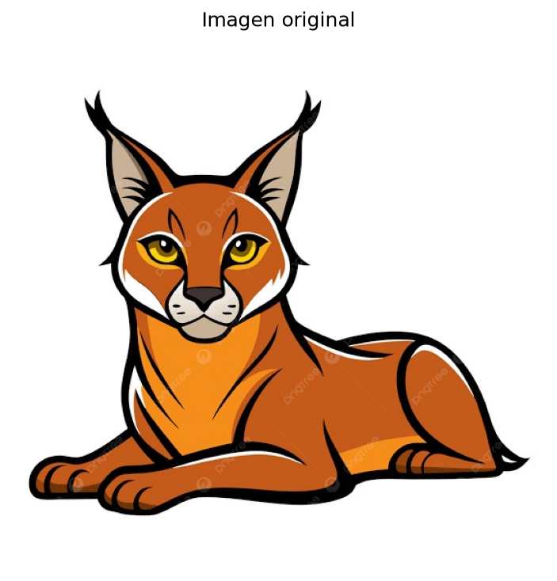

`imagen_np.shape = (480, 640, 3)`

- Alto: **480** píxeles.
- Ancho: **640** píxeles.
- Canales: **3** canales RGB.

Cada dimensión de `imagen_np.shape` representa, respectivamente, `(alto, ancho, canales)`: la primera indica las filas o posición vertical, la segunda las columnas o posición horizontal y la tercera el canal de color: rojo, verde y azul.

Valores RGB solicitados:

- `(0, 0)`: `[241, 241, 241]`
- `(10, 10)`: `[247, 249, 248]`
- `(50, 50)`: `[250, 254, 253]`
- Centro `(240, 320)`: `[153, 119, 117]`

Matriz RGB de los primeros 5 x 5 píxeles:

```text
[[[241 241 241]
  [242 244 243]
  [245 247 246]
  [247 249 248]
  [245 247 246]]

 [[241 241 241]
  [243 243 243]
  [244 246 245]
  [245 247 246]
  [244 246 245]]

 [[244 244 244]
  [245 245 245]
  [247 247 247]
  [246 248 247]
  [246 248 247]]

 [[248 248 248]
  [248 248 248]
  [248 248 248]
  [247 249 248]
  [247 249 248]]

 [[247 247 247]
  [246 246 246]
  [245 245 245]
  [244 244 244]
  [243 245 244]]]
```

## 2. Análisis de los canales RGB

Cada canal tiene dimensiones `(480, 640)`.

| Canal | Promedio | Mínimo | Máximo |
|---|---:|---:|---:|
| Rojo | 196.13 | 73 | 255 |
| Verde | 195.30 | 70 | 255 |
| Azul | 193.07 | 68 | 255 |

El canal con el promedio más alto es **rojo**. Al observar un solo canal se pierde la información de los otros dos colores; por eso no se conserva el color completo, aunque sí se mantiene la intensidad de ese componente en cada píxel.

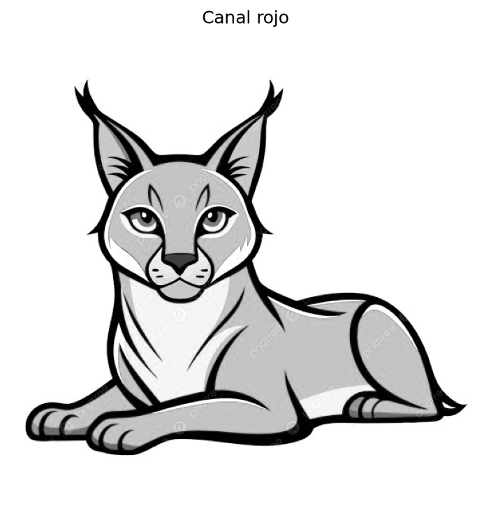
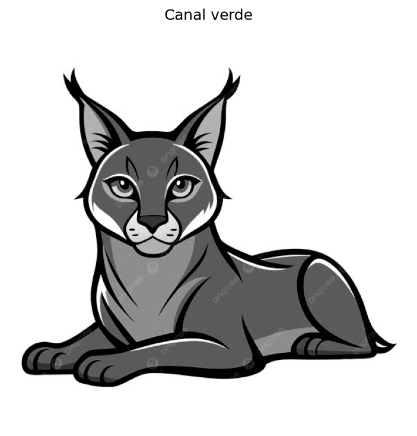
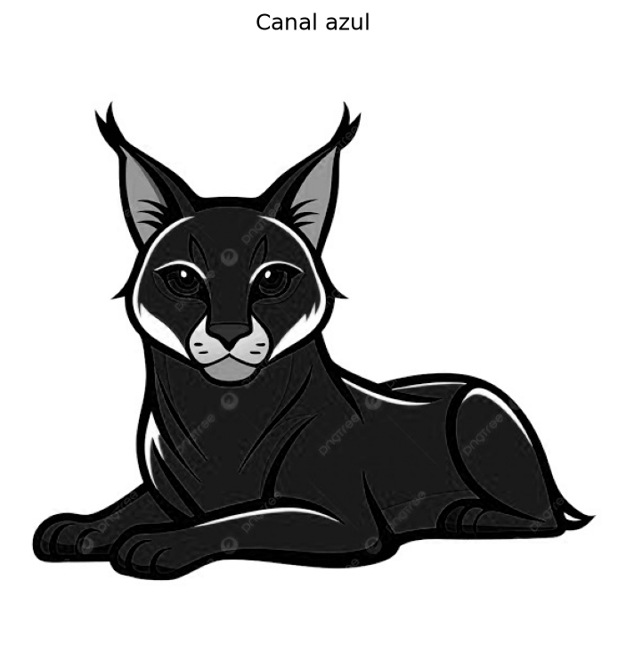

## 3. Escala de grises


`gris_np.shape = (480, 640)`

Intensidad promedio: **195.26**. Mínima: **73**. Máxima: **255**.

Primeros 10 x 10 valores:

```text
[[241 243 246 248 246 244 241 240 241 243]
 [241 243 245 246 245 244 242 242 239 241]
 [244 245 247 247 247 247 247 247 241 242]
 [248 248 248 248 248 248 249 249 246 246]
 [247 246 245 244 244 245 245 246 247 247]
 [246 245 243 243 243 243 243 243 246 246]
 [247 246 245 245 245 245 244 244 245 245]
 [248 247 247 248 248 248 247 245 243 244]
 [246 247 246 247 249 247 247 250 250 248]
 [247 247 246 246 248 247 247 250 249 248]]
```

Conteo aproximado de píxeles por categoría:

- Oscuros (`< 85`): **5268**
- Medios (`85 <= valor <= 170`): **88526**
- Claros (`> 170`): **213406**

La matriz RGB tiene tres dimensiones porque cada posición espacial contiene tres intensidades, una por canal. La matriz en escala de grises tiene dos dimensiones porque cada posición contiene un solo valor de intensidad.

## 4. Modificación de píxeles

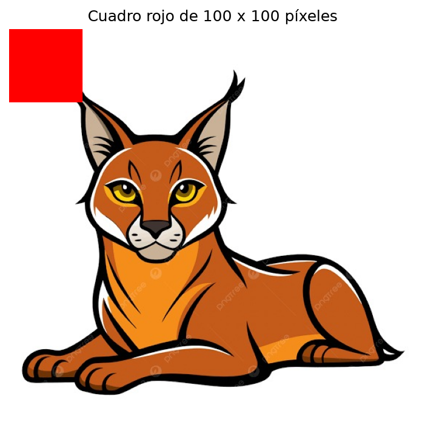

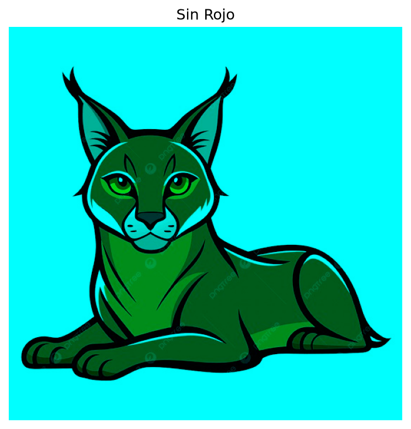
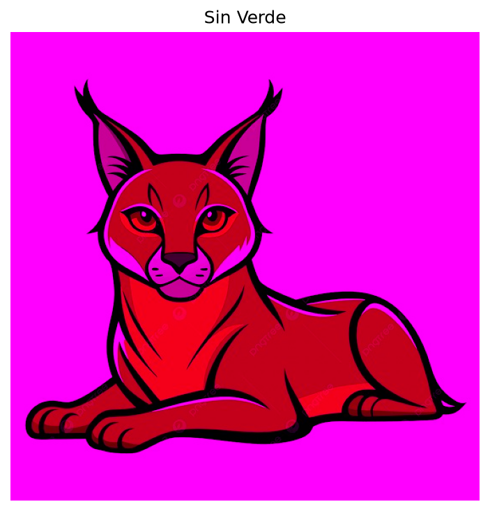
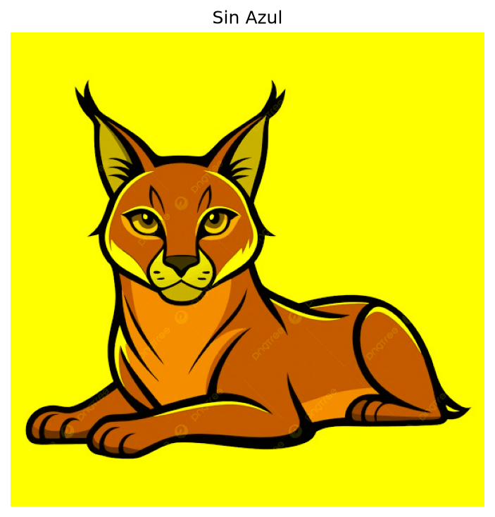

Eliminar el canal rojo reduce los tonos rojos y deja una imagen dominada por verdes y azules; eliminar el verde reduce esos tonos y suele producir una apariencia más magenta; eliminar el azul reduce los tonos azules y deja una apariencia más cálida, con predominio de rojos y verdes.

## 5. Imagen binaria

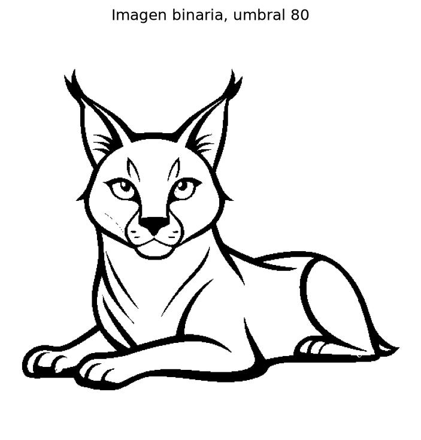
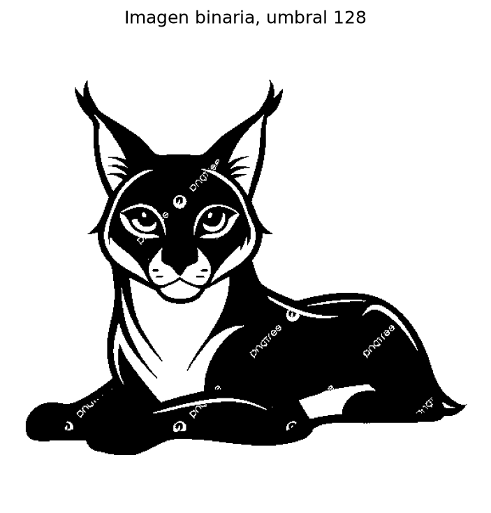
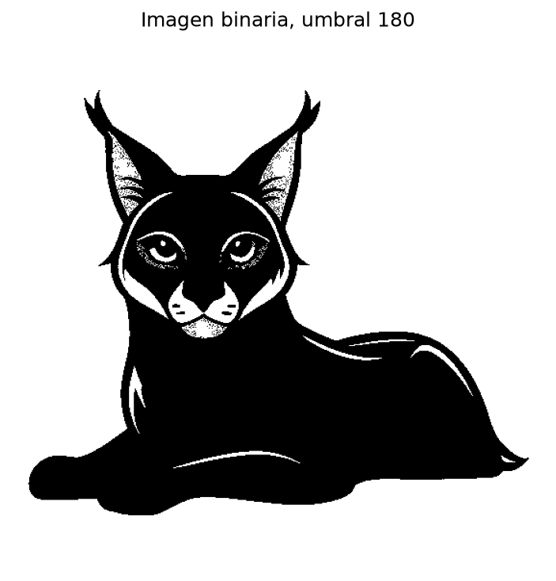

Un umbral menor clasifica más intensidades como claras, por lo que aparecen más píxeles blancos. Al aumentar el umbral, se exige una intensidad mayor para obtener blanco y aumentan los píxeles negros. El umbral 128 produce una separación intermedia.

## 6. Respuestas breves

1. Una imagen RGB se representa como una matriz de forma `(alto, ancho, 3)`; cada posición contiene `[rojo, verde, azul]`.
2. Un píxel es la unidad mínima de la imagen y contiene el color o la intensidad de una posición.
3. Los valores de 0 a 255 representan la intensidad de un canal: 0 es ausencia y 255 es intensidad máxima.
4. Una imagen RGB tiene tres canales de color; una imagen en escala de grises tiene un único canal de intensidad.
5. Al modificar directamente la matriz se modifican los píxeles correspondientes y, al visualizarla o guardarla, cambia la imagen.
6. Las imágenes digitales pueden analizarse y transformarse como datos numéricos: índices, cortes y operaciones sobre matrices producen cambios visuales concretos.

## Código utilizado

El código completo y reproducible está en [`reporte_imagenes.py`](reporte_imagenes.py). Ejecutarlo vuelve a calcular los datos y regenera todas las imágenes y este reporte.

```python
from pathlib import Path

import matplotlib

matplotlib.use("Agg")
import matplotlib.pyplot as plt
import numpy as np
from PIL import Image


CARPETA = Path(__file__).resolve().parent
ENTRADA_SOLICITADA = CARPETA / "image.png"
ENTRADA_ALTERNATIVA = CARPETA / "Imagen.jpg"
SALIDA = CARPETA / "resultados"
SALIDA.mkdir(exist_ok=True)

entrada = ENTRADA_SOLICITADA if ENTRADA_SOLICITADA.exists() else ENTRADA_ALTERNATIVA
if not entrada.exists():
    raise FileNotFoundError("No se encontró image.png ni Imagen.jpg")

imagen = Image.open(entrada)
imagen_np = np.array(imagen.convert("RGB"))
alto, ancho, canales = imagen_np.shape

def guardar_figura(nombre, imagen_mostrada, titulo=None, cmap=None):
    plt.figure(figsize=(8, 5))
    plt.imshow(imagen_mostrada, cmap=cmap)
    if titulo:
        plt.title(titulo)
    plt.axis("off")
    plt.tight_layout()
    plt.savefig(SALIDA / nombre, dpi=150, bbox_inches="tight")
    plt.close()


def pixel_en(fila, columna):
    if fila >= alto or columna >= ancho:
        return "fuera de los límites"
    return imagen_np[fila, columna].tolist()


guardar_figura("01_original.png", imagen_np, "Imagen original")

rojo = imagen_np[:, :, 0]
verde = imagen_np[:, :, 1]
azul = imagen_np[:, :, 2]
canales_rgb = {"rojo": rojo, "verde": verde, "azul": azul}

for nombre, canal in canales_rgb.items():
    guardar_figura(f"canal_{nombre}.png", canal, f"Canal {nombre}", cmap="gray")

imagen_gris = imagen.convert("L")
gris_np = np.array(imagen_gris)
guardar_figura("02_escala_grises.png", gris_np, "Escala de grises", cmap="gray")

imagen_modificada = imagen_np.copy()
imagen_modificada[: min(100, alto), : min(100, ancho)] = [255, 0, 0]
guardar_figura("03_cuadro_rojo.png", imagen_modificada, "Cuadro rojo de 100 x 100 píxeles")

sin_rojo = imagen_np.copy()
sin_rojo[:, :, 0] = 0
sin_verde = imagen_np.copy()
sin_verde[:, :, 1] = 0
sin_azul = imagen_np.copy()
sin_azul[:, :, 2] = 0

sin_canales = {
    "sin_rojo": sin_rojo,
    "sin_verde": sin_verde,
    "sin_azul": sin_azul,
}
for nombre, imagen_sin_canal in sin_canales.items():
    guardar_figura(f"{nombre}.png", imagen_sin_canal, nombre.replace("_", " ").title())

binarias = {}
for umbral in (80, 128, 180):
    binaria = np.where(gris_np < umbral, 0, 255).astype(np.uint8)
    binarias[umbral] = binaria
    guardar_figura(f"binaria_{umbral}.png", binaria, f"Imagen binaria, umbral {umbral}", cmap="gray")

promedios = {nombre: float(np.mean(canal)) for nombre, canal in canales_rgb.items()}
minimos = {nombre: int(np.min(canal)) for nombre, canal in canales_rgb.items()}
maximos = {nombre: int(np.max(canal)) for nombre, canal in canales_rgb.items()}
promedio_gris = float(np.mean(gris_np))
minimo_gris = int(np.min(gris_np))
maximo_gris = int(np.max(gris_np))
conteos_gris = {
    "oscuros": int(np.sum(gris_np < 85)),
    "medios": int(np.sum((gris_np >= 85) & (gris_np <= 170))),
    "claros": int(np.sum(gris_np > 170)),
}

matriz_5x5 = imagen_np[:5, :5].tolist()
matriz_gris_10x10 = gris_np[:10, :10].tolist()
centro = pixel_en(alto // 2, ancho // 2)
lineas_codigo = Path(__file__).read_text(encoding="utf-8")

reporte = f"""# Reporte: manipulación de imágenes como matrices con NumPy

## 1. Exploración de la imagen

La imagen de entrada utilizada fue `{entrada.name}`. El programa acepta también el nombre solicitado `image.png` si ese archivo está presente.


`imagen_np.shape = {imagen_np.shape}`

- Alto: **{alto}** píxeles.
- Ancho: **{ancho}** píxeles.
- Canales: **{canales}** canales RGB.

Cada dimensión de `imagen_np.shape` representa, respectivamente, `(alto, ancho, canales)`: la primera indica las filas o posición vertical, la segunda las columnas o posición horizontal y la tercera el canal de color: rojo, verde y azul.

Valores RGB solicitados:

- `(0, 0)`: `{pixel_en(0, 0)}`
- `(10, 10)`: `{pixel_en(10, 10)}`
- `(50, 50)`: `{pixel_en(50, 50)}`
- Centro `({alto // 2}, {ancho // 2})`: `{centro}`

Matriz RGB de los primeros 5 x 5 píxeles:

```text
{np.array(matriz_5x5)}
```

## 2. Análisis de los canales RGB

Cada canal tiene dimensiones `{rojo.shape}`.

| Canal | Promedio | Mínimo | Máximo |
|---|---:|---:|---:|
| Rojo | {promedios['rojo']:.2f} | {minimos['rojo']} | {maximos['rojo']} |
| Verde | {promedios['verde']:.2f} | {minimos['verde']} | {maximos['verde']} |
| Azul | {promedios['azul']:.2f} | {minimos['azul']} | {maximos['azul']} |

El canal con el promedio más alto es **{max(promedios, key=promedios.get)}**. Al observar un solo canal se pierde la información de los otros dos colores; por eso no se conserva el color completo, aunque sí se mantiene la intensidad de ese componente en cada píxel.


## 3. Escala de grises


`gris_np.shape = {gris_np.shape}`

Intensidad promedio: **{promedio_gris:.2f}**. Mínima: **{minimo_gris}**. Máxima: **{maximo_gris}**.

Primeros 10 x 10 valores:

```text
{np.array(matriz_gris_10x10)}
```

Conteo aproximado de píxeles por categoría:

- Oscuros (`< 85`): **{conteos_gris['oscuros']}**
- Medios (`85 <= valor <= 170`): **{conteos_gris['medios']}**
- Claros (`> 170`): **{conteos_gris['claros']}**

La matriz RGB tiene tres dimensiones porque cada posición espacial contiene tres intensidades, una por canal. La matriz en escala de grises tiene dos dimensiones porque cada posición contiene un solo valor de intensidad.

## 4. Modificación de píxeles


Eliminar el canal rojo reduce los tonos rojos y deja una imagen dominada por verdes y azules; eliminar el verde reduce esos tonos y suele producir una apariencia más magenta; eliminar el azul reduce los tonos azules y deja una apariencia más cálida, con predominio de rojos y verdes.

## 5. Imagen binaria


Un umbral menor clasifica más intensidades como claras, por lo que aparecen más píxeles blancos. Al aumentar el umbral, se exige una intensidad mayor para obtener blanco y aumentan los píxeles negros. El umbral 128 produce una separación intermedia.

## 6. Respuestas breves

1. Una imagen RGB se representa como una matriz de forma `(alto, ancho, 3)`; cada posición contiene `[rojo, verde, azul]`.
2. Un píxel es la unidad mínima de la imagen y contiene el color o la intensidad de una posición.
3. Los valores de 0 a 255 representan la intensidad de un canal: 0 es ausencia y 255 es intensidad máxima.
4. Una imagen RGB tiene tres canales de color; una imagen en escala de grises tiene un único canal de intensidad.
5. Al modificar directamente la matriz se modifican los píxeles correspondientes y, al visualizarla o guardarla, cambia la imagen.
6. Las imágenes digitales pueden analizarse y transformarse como datos numéricos: índices, cortes y operaciones sobre matrices producen cambios visuales concretos.

## Código utilizado

El código completo y reproducible está en [`reporte_imagenes.py`](reporte_imagenes.py). Ejecutarlo vuelve a calcular los datos y regenera todas las imágenes y este reporte.

```python
{lineas_codigo}
```
"""

(CARPETA / "REPORTE.md").write_text(reporte, encoding="utf-8")
print(f"Reporte generado en: {CARPETA / 'REPORTE.md'}")
print(f"Imagen usada: {entrada.name}; dimensiones RGB: {imagen_np.shape}")
```
